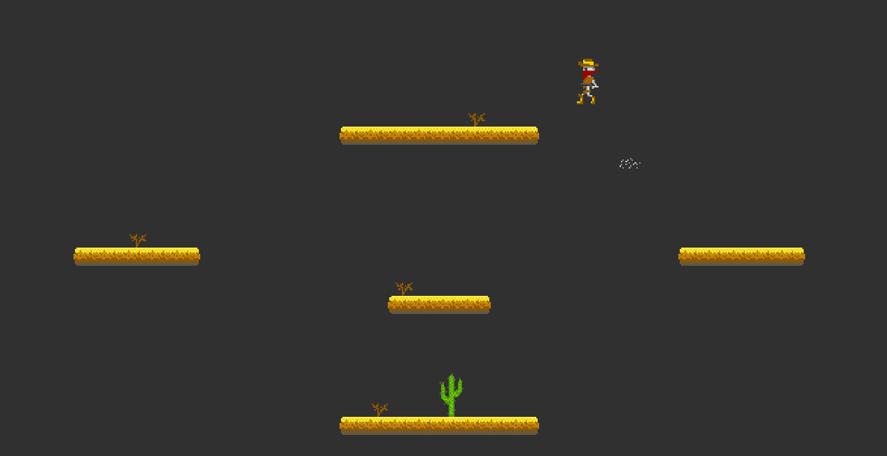
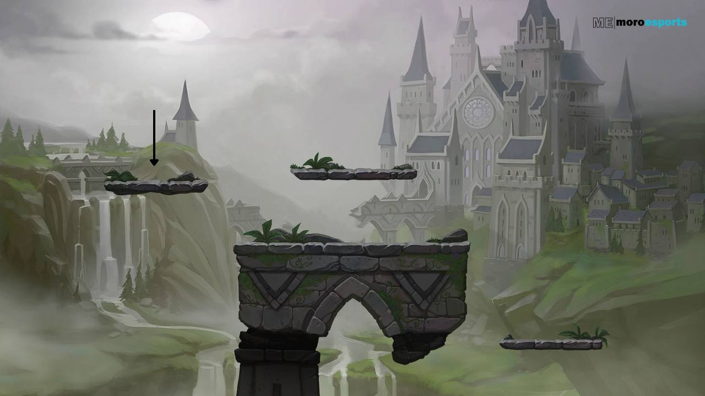
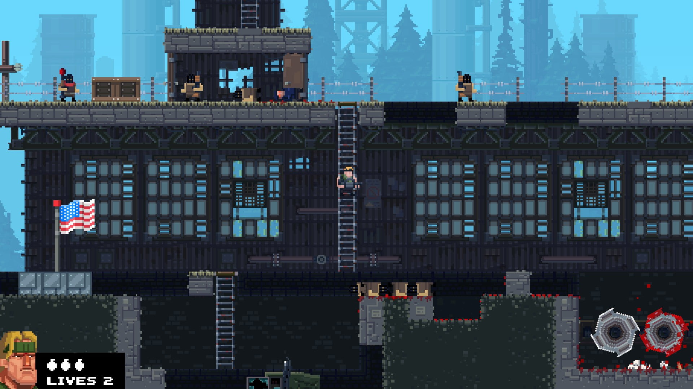
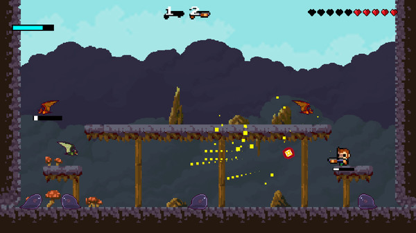

# Gravity Duel GDD

[gdd manual video I used as reference](https://www.youtube.com/watch?v=xccxmytvnC4)

## Table of Contents
- [Current version](#current-version)
- [Concept](#concept)
- [Tech Stack](#tech-stack)
- [Controls](#controls)
- [Style of the Game](#style-of-the-game)

## Current version
- Available at [belkovanya.site/gravity-duel](https://belkovanya.site/gravity-duel/)

---

---

## Concept
Genre: 2d / platform / shooter / online PvP.

Similar: Brawhalla

#### TODO: Synopsis

## Controls

|action | key|alternatives|
|-|:-:|:-:|
|jump|↑|w|
|going left| ←|a|
|going right| →|d|
|attack_1|z|

## Style of the Game
### Design:
- Pixel art
- Single palette
- 

<big>Gallery (references)</big>

<head>
<link rel="stylesheet" href="gallery-style.css">
</head>
<body>
<h3> Map </h3>

    

        
        
Gangfort

    

    

        
        
Brawhalla

    

    

        
        
Expendabros

    

<h3> Attack </h3>

    

        
        
Brawhalla

    

    

        
        
Expendabros

    

    

        
        
Ha-do-ken

    

  <!--  -->

<h3>Character</h3>

    
    
    

<h3>Interface / Interior</h3>

    

        
        
Gangfort

    

    

        
        
Hero Ring

    

    <!-- 

        
        
Ha-do-ken

    
 -->
  <!--  -->

</body>
<!-- <h3>Other</h3>

    

 -->

## Gameplay
- PvP arena
- Platform 2D (like Brawhalla)
- Shooter (distance attacks)
- The goal is to push other players into the abyss

<!-- ## Tech stack
Frontend:
- Javascript, CSS, HTML
- WebGL

Backend:
- Node.js

Connection:
- WebSocket

[a relative link](docs/server-multiplayer.md) -->