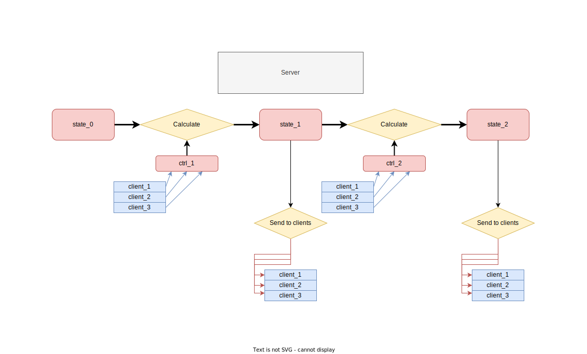

# Server tech doc

Solves synchronization problems

# Concept

*Basic idea:*
- **Authoritorian server**

    (Everything happens ***on server only***)
- Player sends ***keys input*** to server
- Server sends ***game state*** to player

*Important:*
- Server ***does not care*** about client

    *(Almost)*

*Improvement N1:*
- Client ***predicts*** next states
- Server sends ***game state*** ->

    -> client ***compares*** it with prediction

# 1 Client Architecture

## Server
- **state_5** - *game state* number *5* **produced by server**
- **pstate_5** - *game state* number *5* **predicted by client**
- **ctrl_2** - *controls state* before calculating:
    - **state_2** (on **server**)
    - **pstate_2** (on **client**)
    - **ctrl_2** is ***different*** for **server** and for **client**:
        - **client** only ***predicts*** itself controls state (before he gets **state_2** from **server**)

## Client

## Client-Server interaction
### 1. Client state disproved

### 2. Client state approved

### 3. Client state outdated

<big>Full Diagram</big>

